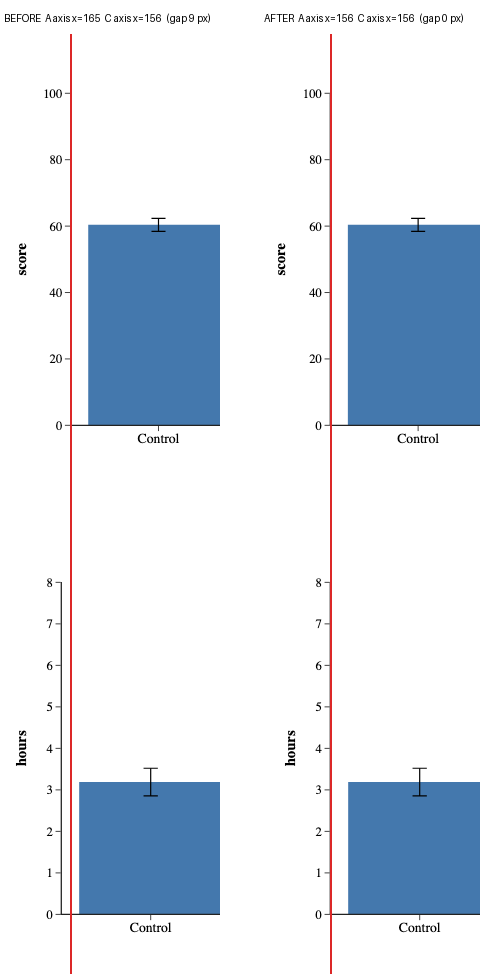
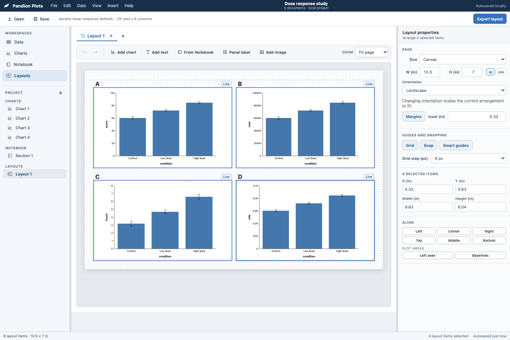
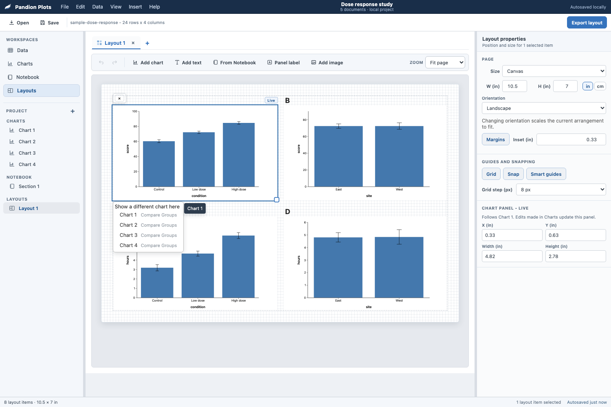
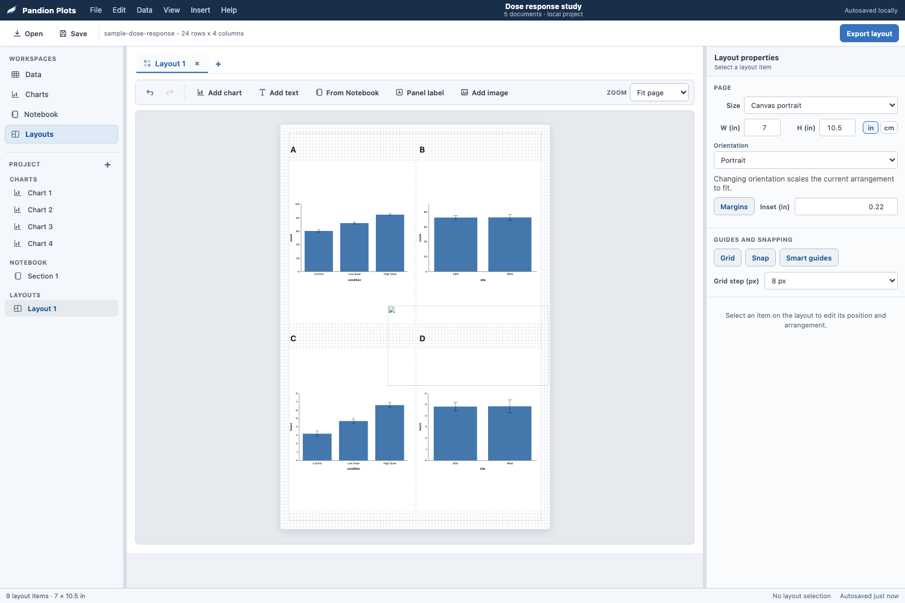

# Layouts deep dive

Branch `probe/layout-deepdive`, commits `cba8f8f` and `fb9e327`.
Nothing here is shipped. Approve item by item.

I built a real 2 by 2 publication figure, exported it, changed a chart under
it, rearranged it, tried to reuse it, and drove the whole thing from the
keyboard. What follows is what that cost, and what it should cost.

The measurements come from the four-panel template holding four Compare
Groups charts of the same categories on four different scales (score, cost,
hours, rate), which is the ordinary paper case.

---

## 1. A figure whose panels are the same size still looks crooked

**What a user feels.** They line the panels up perfectly, and the printed
figure still looks a little off, so they open Illustrator and nudge until it
stops bothering them.

**The evidence.** A panel's box carries its tick labels, and an axis reading
`100000` is wider than one reading `0.10`. So the four-panel template, which
gives every panel exactly 463 by 267 pixels, draws the left column's y axes
**6 px apart** and the right column's **11 px apart**. On a 7-inch printed
figure that is about 3 mm, which is well past the point a careful reader
notices. Aligning the panel boxes cannot fix it, because the boxes are
already aligned; the thing that is crooked is the drawing inside them.

This is the one job a figure tool can do that a page-layout tool cannot, and
it is the reason `patchwork` and matplotlib's `constrained_layout` exist.
They know the rectangles are charts with axes, not rectangles with pixels.
Pandion knows that too and was not using it.

Before and after, with a reference line drawn through panel A's axis.



**The prototype.** `cba8f8f`. Two buttons appear under Align, in their own
`PLOT AREAS` row, when the selection actually holds two chart panels that
share a column or a row. **Left axes** and **Baselines** move the panels so
the drawn plots coincide.



Three decisions inside it worth naming.

* It groups the selection by the column or row the panels already sit in, so
  select-all plus one click fixes an entire 2 by 2 grid. Grouping is plain
  box overlap, which is what "same column" looks like on screen.
* It measures the axis as a **fraction of the item box**, never in screen
  pixels, so it is invariant to the fit-page zoom and to a live drag
  transform. The residual error after aligning is under 0.02 page pixels.
* It is an action, not a mode. Silent geometry is against the house rule,
  and a mode would fight every subsequent drag.

**Cost.** One file plus markup and CSS. About 130 lines of shell, no engine
change, no new persisted state, no new option. One undo step. No existing
probe moved.

**Smallest version.** What is built is already the small version. A smaller
one still (a single "Line up the axes" button that does columns and rows at
once) saves about 20 lines and costs the user the ability to say which.

**What it risks.** After aligning, a panel's box sits a few pixels left of
where it was, so the A/B/C/D letters no longer sit at the same offset from
each plot. They are separate text items and nothing moves them. That is
honest but it is a loose end; the standard answer is grouping (item 7).
Guarded by `layout-figure-check` cases 1 to 4.

**The alternative I did not build.** The textbook fix is the other way
round, having every chart in the set *reserve the same gutter* so the panels
never disagree in the first place. That needs an engine change, a payload
key floored into `_computeLeftReserved` and `_computeAxisBottomBase`, in
exactly the shape convention 15 already sanctions for `textScale`, meaning one
key, clamped, floors only, identity when absent. It is about fifteen lines of
engine plus a two-pass render in the shell, and it would also fix the
letterboxing in item 5 for free. I did not build it because it is a day with
a jamovi blast radius, and because the shell-side version measures exact. If
you want the textbook version, it is a well-scoped day and I would take it.

---

## 2. "Print - 300 DPI" produced a file that says it is 44 inches wide

**What a user feels.** They export at 300 DPI, drop the file into Word or a
submission portal, and it arrives enormous and is flagged as low resolution.
They resize it by hand and hope.

**The evidence.** The pixels were always right. The *declaration* was
missing. `canvas.toBlob` writes no density metadata, so the exported PNG was
3150 by 2100 with no `pHYs` chunk and the JPEG carried JFIF `units=0,
density 1x1`. Every reader then assumes 72 or 96 dpi.

```
before   3150 x 2100, dpi = None      -> opens at 43.75 x 29.17 in
after    3150 x 2100, dpi = (300,300) -> opens at 10.50 x  7.00 in
```

which is the page size the user actually set.

**The prototype.** `cba8f8f`. The encoded bytes are patched after `toBlob`,
with a `pHYs` chunk inserted before the first `IDAT` for PNG and the five
JFIF density bytes rewritten for JPEG. Both are single well-defined edits on a
file the browser just produced and both return null (leaving the blob
untouched) on anything unexpected.

**Cost.** About 85 lines in one file, including a CRC32 table. No
dependency. Affects every raster export, Copy as image, and layout
snapshots, all of which route through `rasterizeExport`. `copy-image-check`
and the export battery both still pass.

**Smallest version.** PNG only. JPEG is nine more lines and journals accept
both, so there is no reason to split it.

**What it risks.** A malformed patch would corrupt every raster export.
`layout-figure-check` case 10 parses the real chunk out of a real export and
asserts 300 dpi in both formats; `copy-image-check` and `m1-shell-check`'s
export battery cover the rest of the pipeline.

---

## 3. A panel cannot be pointed at a different chart

**What a user feels.** They put the wrong chart in panel C, or they want to
reuse a finished figure for a second set of results, and the only route is
delete the panel and place a new one, which throws away the exact position
and size the figure was built on.

**The evidence.** The panel right-click offered Duplicate, Delete and four
layering commands. There was no way to change which chart a panel shows.
That makes the brief's task 7 (reuse a layout for a second dataset) a
rebuild rather than four picks, and task 4 (rearrange into a different
reading order) a drag-and-measure exercise instead of two swaps.

**The prototype.** `cba8f8f`. "Show a different chart here" in the panel
right-click opens the existing Add-chart flyout in replace mode, anchored to
the panel, with the chart it already shows disabled. Picking one keeps the
box exactly and is one undo.



**Cost.** About 45 lines. Reuses the flyout, the snapshot ensure pass and
the layout history. No new markup.

**Smallest version.** This is it.

**What it risks.** Very little; the panel already tolerates its chart
changing underneath it, which is what "Live" means. Guarded by
`layout-figure-check` case 7.

---

## 4. The Orientation control is the least trustworthy thing on the page

Two separate defects, one fixed and one needing a decision.

**Fixed.** The flip scaled chart panels and left **image items at their old
size**, because it tested `kind === "chart"` where every other sized-item
path tests `laySizedKind`. A 400 by 200 logo stayed 400 by 200 while the
panels around it shrank to two thirds, so it landed across the figure.
Verified, fixed in `cba8f8f`, guarded by case 8.

This turned out bigger than I wrote it up. The Notebook dive, merged into
this branch afterwards, added **From Notebook**, and a placed Notebook page
arrives as `kind: "image"` (`ps-shell.js` around line 5940, carrying
`srcChart`, `srcPin` and the drift fingerprint). So image items are not the
rare pasted logo any more, they are how one of the two ways to get content
onto a page works, and every one of them survived an orientation flip at the
wrong size. The fix already covers them because it keys off `laySizedKind`.

**Needs a decision.** The flip scales width by `sx` and height by `sy`
*independently*, so a 463 by 267 panel becomes 309 by 401. The chart inside
has a fixed aspect, so it shrinks to the smaller dimension and the panel
fills with white. A landscape 2 by 2 flipped to portrait comes back with
panels that are about two thirds empty.



The copy says "Changing orientation scales the current arrangement to fit",
which is true and still produces a figure nobody would use.

*Recommendation.* Scale by one factor, `min(sx, sy)`, so every item keeps
its shape, then centre the result on the new page. A flipped figure then
looks like the original at a smaller size, which is what "scales to fit"
promises. About 15 lines, one probe case, and it changes the behaviour of an
existing control, which is why it is a decision rather than a free win.

---

## 5. Fifteen per cent of every template panel is dead space

**What a user feels.** The gutters in their figure are wider than they set
them, and dragging a panel's edge to close the gap does nothing, because the
gap is inside the panel.

**The evidence.** `layoutTemplateRects` derives panel boxes from the page
alone and never looks at the charts going into them. A four-panel cell is
463 by 267 (aspect 1.734); a chart canvas is 720 by 490 (aspect 1.469). With
`preserveAspectRatio="xMidYMid meet"` the chart draws 392 by 267 and is
centred, leaving **35 px of dead space on each side of every panel**, 15.2%
of the panel width. Alignment, snapping and the smart guides all operate on
the box, so the user is aligning something 35 px away from what they see.

**BUILT**, `35b2750`. Template cells shrink onto the chart's aspect about
their own centre, so a grid stays a grid, and the two placement paths take a
height from the chart rather than the constant 310 that was 1.484 against the
engine's 1.469.

**The exported figure does not change**, which is the fact that made this
safe to take before deciding item 1. The ink was already drawn at the fitted
size and centred in the box; only the invisible rectangle moves. Verified
against a pre-change export at the same page size, the ink bounding box is
unchanged, the bar runs land within a pixel, and the best whole-pixel
alignment between the two images is zero. The 7120 differing pixels out of
677376 are sub-pixel antialiasing from rounding the fitted box to whole
pixels.

**Cost.** About 30 lines. New layouts only; existing ones are untouched.

**What it risks.** Nothing measured. It does NOT tighten the gutter between
columns, because the panels shrink about their own centres, so the visible
gap between two panels grows by the letterbox amount they each shed. Packing
the grid tighter is a further change and would move the figure, which this
one deliberately does not.

---

## 6. Restyling four panel labels means four separate edits

**What a user feels.** They want the panel letters at 14 pt bold, select all
four, and the rail shows nothing about text at all.

**The evidence.** Select one text item and the rail offers Size, Bold,
Italic, Color and Rotate. Select four and the TEXT section disappears
entirely, leaving only Align and a read-only geometry block. Every design
tool applies text properties to the whole selection.

**BUILT**, `3600e7b`. The section stays whenever the selection holds any text
item, says how many it is about to change, and applies to all of them.

A SUBSET is allowed on purpose, which is a change from what I first proposed.
Requiring an all-text selection reads tidier until you try it. A marquee that
catches a column catches its labels with it, so the gesture that finds the
labels would have been the one gesture that cannot style them. The heading
carries the count so the scope is never a guess.

Where the set disagrees the control says so rather than showing one member's
value and implying the rest match. A number field goes blank with a Mixed
placeholder and a toggle reports `aria-pressed="mixed"`, which is real ARIA
rather than a look.

**Cost.** About 70 lines. It also moved the align section above the text
section (`6ce9569`), because Text had never coexisted with Align before and
its colour picker is around 330 px tall, so a selection made in order to
arrange something pushed every arrangement control below the fold.

**What it risks.** `layout-text-check` case 1 asserted the OLD contract, that
the section LEAVES on a multi-selection. Rewritten to the new one with the
reason in the probe, rather than quietly.

---

## 7. Marquee selection, grouping, and Alt-drag do not exist

**What a user feels.** They drag a box around three items expecting to
select them, and instead the selection clears.

**The evidence.** A reflex sweep against the canvas.

| reflex | result |
| --- | --- |
| drag on empty canvas (marquee) | clears the selection |
| Alt+drag to duplicate | moves, does not duplicate |
| Cmd/Ctrl+G to group | nothing |
| Cmd/Ctrl+D duplicate | works |
| Cmd/Ctrl+A select all | works |
| Cmd/Ctrl+wheel zoom | works |
| Cmd/Ctrl+0, +, - | nothing (now fixed, item F3) |
| an expression in a number field | rejected, the fields are `type=number` |

Marquee is the largest of these. It is the gesture that makes multi-select
cheap, and multi-select is what items 1 and 6 both depend on.

**Marquee is BUILT**, `3600e7b`. A drag on empty canvas draws a box and
selects what it touches, live, so you can see what you are about to get.

Three decisions inside it. It is INTERSECT rather than contain, the Figma and
Illustrator rule, because a panel letter is a small item at a panel's corner
and requiring a box that encloses it makes the tiny things the hardest to
catch. Shift or Cmd adds to what is already selected, matching the click
gesture it sits beside. And Escape abandons the box and restores the
selection that was there, the way Escape abandons an item drag, which is also
where the one bug in it was, because the base selection was being captured
only for the additive case and a cancelled plain drag left the selection
empty.

The box lives INSIDE the canvas, so it inherits the zoom transform and is
positioned in ordinary page pixels, and every pointer delta is divided by the
zoom. It paints selection classes directly rather than calling
`renderLayout`, because a rebuild would destroy the node the gesture is
drawing into.

**Cost.** About 130 lines. No AT work was needed after all, because the
canvas is `aria-hidden` and the option list is rebuilt by `renderLayout` on
release, so a pointer-only gesture has nothing to mirror mid-drag.

**Still open.** Grouping (Cmd/Ctrl+G) and Alt+drag to duplicate. Grouping is
also the honest answer to the loose end in item 1, and I would still let it
wait for evidence that people want it.

---

## 8. One arrow key, two opposite meanings

**What a user feels.** They press the right arrow and sometimes the panel
moves and sometimes the selection jumps to a different panel, and they
cannot tell what decides it.

**The evidence.** Inside the canvas, plain arrows navigate between items and
Alt+Arrow nudges, which is the engine's own rule and the right one for the
assistive-technology model. But a second handler further down the same
keydown function nudges on **plain** arrows whenever focus is anywhere else
in the layout workspace, which in practice is any time the user has just
clicked a rail or toolbar button. Same key, opposite effect, decided by
something invisible.

This one cost me twenty minutes of a probe looking like an app bug.

*Recommendation.* Delete the fall-through, so Alt+Arrow nudges everywhere
and plain arrows never move anything. One rule, matching the engine and the
canvas. It is a decision because it removes a shortcut some users may have
learned. Three lines and one probe case.

---

## 9. There is no "make these the same size"

**What a user feels.** Two panels are nearly the same size. They read the
width off one, select the other, and type it in. Twice, for width and
height.

**The evidence.** The rail offers six align commands and no match-size
command. Illustrator, Figma, PowerPoint and Keynote all have one, and it is
the second reflex after align in every multi-panel figure. Resize is also
only available from a **single bottom-right corner handle**; there are no
edge handles and no other corners.

**BUILT**, `3600e7b`. A `SAME SIZE` row with Width, Height and Both, sizing
to the primary, which is the last item added to the selection, the key-object
convention. The buttons NAME it ("Match the width of Chart 2"), so the
question a match-size command always raises is answered before it is asked.
Text items are skipped, because they size themselves to their content, and
the row hides when the selection holds none that qualify.

**Cost.** About 55 lines, reusing `layAlign`'s grammar and `laySnapshot`. One
history entry per press.

**Still open.** Edge handles. A panel still resizes only from its
bottom-right corner, which is a separate and larger piece of work.

---

## 10. Layout text was a different width in the file than on screen

**What a user feels.** They line a caption up against a panel edge, export,
and it is not quite where they put it.

**The evidence.** An adversarial pass reported that exported text was not
where the screen put it. Half right, and the half that was wrong mattered, so
this is what the measurement says. The ANCHOR is exact, because the export
writes `item.x + 4` and the screen's own 4 px inset puts the ink in the same
place, 204 against 204. What differed was the WIDTH. The export writes
`sans-serif` deliberately, so the file renders the same everywhere and the
PDF path can map it to a core font, while the canvas drew in the application
UI stack, which measures 3 to 5 percent wider. A 320 px caption came out
16.5 px narrower in the file. That is not cosmetic, because `layItemRect`
measures the SCREEN box and align, the marquee and the page clamp all reason
from it.

**The prototype.** `19f7be4`. The canvas draws the font the file declares.
Fixing the export end instead would have been the wrong way round, because
the portable declaration is the correct one and shipping a UI font stack into
an SVG makes a file that renders differently on every machine. Measured
after, the same caption is 294.83 px on screen and 294.82 px in the file.

**Cost.** Two CSS declarations. The layout canvas's text now looks like the
output font, which a figure composer should show anyway.

**What it risks.** The canvas looks very slightly different. Guarded by
`layout-figure-check` case 25, which pins screen family, export family and
measured width together.

---

## 11. Three rules for where a new thing lands, and the loudest one covered your work

**What a user feels.** They build a four-panel figure, decide it needs a
fifth chart, and press Add chart. The new panel appears on top of panel A.
They drag it out of the way. Later they send a chart across from the chart
workspace instead, and that one goes somewhere else entirely, at a different
size.

**The evidence.** Measured on the code before the change.

| route | where it landed | size |
| --- | --- | --- |
| Add chart on a two-column template | 128,112, across BOTH panels | 460 wide against the template's 463 |
| Add chart on a full four-panel page | 76,68, across two panels, page unchanged, nothing said | 460 |
| Send to layout, twice, into an empty layout | y 32 then y 359, page grown to 704 | 460 |

Three functions, three answers. `layStagger()` cascaded from the top-left
corner in steps of 26 by 22 and wrapped every sixth item, so the seventh
thing you added landed exactly on the first. `addChartToLayout` and
`addPinToLayout` stacked below everything and grew the page. `layPlaceImage`
did a clamped variant of the cascade. The cascade is the one that hurts,
because it deliberately starts where your work already is.

**BUILT**, `layPlaceRect`. One rule, and it is the reading order of a figure.
Take the first clear space going left to right and top to bottom; when the
page is full, go below the last item and grow the page, which is what Send to
layout always did. Candidate edges are the page margin, every item's left and
top, and every item's right and bottom plus the 18 px gutter the templates
use. The left and top edges are what make a new panel land in a template's
empty cell aligned with the column above it. A template panel is fitted to
its chart and centred in its cell, so its left edge is nowhere near its
neighbour's right edge plus a gutter.

Two things ride with it. A new chart panel takes the **most common width
among the panels already in the figure**, so the fifth panel of a 2 by 2
arrives at 392 rather than 460 and is already alignable; height still comes
from the chart's own aspect, so the panel contains its chart exactly. And the
page growth happens **inside the add's own history entry**, so one undo takes
back both the panel and the height, with a toast that says the page grew.

**Cost.** About 90 lines, replacing 8. Four probe cases. No new persisted
state and no new option.

**What the adversarial pass found.** Eight agents, four probe shards and four
lenses. Two committed probes went from pass to fail, both on the placement
change and both reproduced serially, and `run.sh` uses `set -e` so either
would have closed the gate.

- `m1-shell-check` drags a panel by 60 px and asserts the model moved by 60.
  Two toolbar-added panels now sit side by side across the content width, and
  the right-hand one has 38 px of travel before the page edge, so the case was
  measuring a correct clamp. The drag moved to the panel with room.
- `layout-arrange-check` right-clicks an item by hit-testing its centre. Every
  toolbar-added text item now lands on one row, so the previous case's Align
  left leaves two of them exactly stacked and the hit test is ambiguous by
  construction. That case spreads them first. Aligning items that share a y
  really does stack them, for the user too, which belongs to align.

Four defects in the change itself, all fixed and all now covered.

- Page growth was written straight into `page.h`. `layNormalizeLayout` clamps
  at 4000, so asking past it toasted that the page had grown over an item that
  had just been clamped back on top of the figure. There is one `LAY_PAGE_MAX`
  now, the placement caps what it asks for against it, and a page already at
  its largest says so instead.
- A pasted paragraph measured 21 px tall against the 284 px it renders,
  because the text estimate counted characters on the longest logical line and
  never wrapped. It now measures through the same `wrapCaptionLines` the
  export uses, in the family, weight and cap the canvas declares, so the
  number is the same whether or not the layout is on screen. Paste also
  discloses page growth, which it never did.
- Bringing the new item into view used `scrollIntoView`, which negotiates with
  every scrolling ancestor. Measured at 200 per cent in a 1440 by 620 window,
  it scrolled the workspace pane 33 px and moved the toolbar from 132 to 99,
  out from under the pointer. It scrolls the viewport itself now.
- Width matching read only `kind === "chart"`, so a figure built entirely from
  Notebook pages, which are image items, got the flat 460 and matched nothing.
  Image panels set the width when there are no chart panels.

**And one in the commit before it.** `layoutTextNode` has been passing a font
to `wrapCaptionLines` since item 10, and `wrapCaptionLines` took three
arguments, so the fourth went on the floor and the file wrapped in the UI font
stack while declaring `sans-serif`. Headless Chromium resolves both to the
same face, which is exactly why item 10's probe agreed; a Mac resolves them to
San Francisco and Helvetica. Case 42 pins it through weight, where a bold
caption has to break earlier than the same words in regular.

---

## 12. "Three panels" does not make the figure it advertises

**What a user feels.** They pick the template whose picture shows a wide chart
above two smaller ones, and get three identical panels, the top one floating
in the middle of a lot of white.

**The evidence.** The template's own words are "One wide chart above two
supporting charts" and its preview draws the top bar more than twice the width
of the two below. Measured output on the default 1008 by 672 page with panel
letters on: all three panels 392 by 267, the top one at x 308 with 276 px of
white either side, the two below at x 67 and x 548.

The cause is arithmetic rather than a bug. A chart's aspect is fixed at 1.469,
so a 267 px tall panel is 392 px wide no matter how wide its cell is, and the
top cell's extra 552 px cannot be used. Before panels were fitted to their
charts (item 5) the box was 944 wide and the ink was still 392, so this is
what the template has always produced. Fitting only made the box honest.

**Proposed.** Size the rows so the top panel spans the two below rather than
splitting the height evenly. Solving for it on the default page gives a 388 px
top row and a 202 px bottom row, which is a 529 by 360 panel over two 256 by
174 panels whose combined width matches it, and the bottom pair positioned
from the top panel's span rather than from the half cells.

**Cost.** About 30 lines in `layoutTemplateRects` and
`createLayoutFromTemplate`, plus a probe case. Templates run only at creation,
so no saved figure changes.

**Not built**, because it changes what a template produces and that is a
design call rather than a defect fix.

---

## 13. The status bar counted the right thing and called it the wrong name

**What a user feels.** A histogram with fourteen bars on screen, and a status
bar that says "1 bin". A grouped frequency chart that says "2 categorys".

**The evidence.** Two faults on one line of `chartCaseText`. The plural was
`noun + "s"`, which is where "categorys" and "response categorys" came from.
And Distribution ships ONE payload cell per group with the raw values inside
it, because the engine bins client-side, so `bars.length` is the number of
distributions drawn and never the number of bins. The bin count is not in the
payload to report at all.

**BUILT.** Declared plurals, and Distribution reports distributions. Verified
against a chart drawing fourteen bars, where the line now reads "24 cases, 1
distribution". Covered by `statusbar-check` case 5, demonstrated failing first
at "24 cases, 3 categorys".

---

# Free wins

All five are in `cba8f8f`, all five were demonstrated failing first, all
five are covered by `layout-figure-check`.

**F1 · A nudge on one panel no longer folds into a nudge on another.**
The undo coalesce key was the literal string `"move"`, so nudging panel A
and then panel B within 1.2 seconds produced one history entry and one
undo pulled both back. The key now carries the selection.

**F2 · Disabled Width and Height read as disabled.** On a multi-selection
they showed the union size, were `disabled`, and rendered *identically* to
the live X and Y beside them with no tooltip. This is the same defect the
Align buttons had before Jul 27, applied to inputs. They are now muted and
say "Size applies to one item at a time."

**F3 · Cmd/Ctrl+0, + and - drive the canvas zoom.** Cmd+wheel already
worked; the three keys every canvas application binds did nothing. Cmd+0
toggles fit-page and actual size. (Worth recording, these must be bound at
**capture** on `window`. Something on the way down already stops propagation
for plain Cmd chords, so a bubble-phase listener never sees `=` or `-` at
all, while `0` arrives, which made the first attempt look half-working.)

**F4 · Deleting a chart says which layouts use it.** The toast said
"Deleted Chart 2 / Undo". A layout keeps drawing the deleted chart's
captured picture for the rest of the session, so nothing looked wrong until
the next launch, by which point the undo was long gone and the panel read
"(this chart was closed)". It now says "Deleted Chart 2 (used by Layout 1)".

**F5 · The geometry-field listeners are registered once.** The
`["x","y","w","h"].forEach(...)` block appeared twice in immediate
succession, so every typed X/Y/W/H ran `layApplyInspector` twice.

**F6 · Sending something to a layout is one undoable step.** Found late, by
an adversarial auditor run over the merge, and it is the one lead from the
brief that my own passes missed. `addChartToLayout` and `addPinToLayout`
mutate the target layout while a DIFFERENT document is on screen, and
neither took a snapshot. Worse than the lead said, because the send does
three things. It adds an item, it grows the page, and it flips the preset to
custom. With no step recorded, the next Cmd/Ctrl+Z in that layout removed
the sent panel AND reverted whatever the user had done before it, in one
unlabelled move. Measured before the fix, depth 1 to 1 across the send, then
one undo took the panel off and put an aligned column back to where it
started. The fix is `laySnapshotDoc(doc, label)`, the same push aimed at a
named document rather than the active one, storing that document's selection
only when it is the one on screen. Probe case 11, demonstrated failing
first.

**F7 · Selecting a panel no longer covers its own letter.** The bar sat at
(277, 230, 33x24) and the "A" label at (277, 235, 19x24), measured, so
selecting panel A hid the A. Filed as one line and it was not, because
offsetting the bar downward puts it on the NEXT row's letter in a labelled
grid, which is worse; it then covers a different panel's letter. It moves to the top
CENTRE, which is free of the label at the left and the Live badge at the
right. The letter is content and ships in the export; the bar is chrome, so
the chrome moves.

---

# Needs a decision

Three of the original five are now built and out of this table. What is left
changes what an EXISTING gesture does, rather than adding a capability, which
is why I have not taken them on my own.

| | Recommendation | Cost of each branch |
| --- | --- | --- |
| **Orientation flip** (item 4) | Scale by `min(sx, sy)` and centre, so items keep their shape | Fix: ~15 lines + 1 probe case. Leave: a portrait flip keeps producing panels that are about two thirds empty, and it is now the ONLY way an item can end up letterboxed |
| **Arrow keys** (item 8) | Delete the fall-through; Alt+Arrow nudges everywhere | Fix: 3 lines. Leave: the same key keeps meaning two things depending on where focus happens to be |
| **Engine common gutter** (item 1) | Take it only if you want alignment to be automatic rather than a button | Engine: ~15 lines + a shell two-pass + the jamovi battery on both bundles, about a day. Not taking it: the shipped button measures exact, and item 5 has since removed the letterboxing it would also have fixed |

Still unbuilt and needing no decision, in the order I would take them:
grouping (Cmd/Ctrl+G), which is also the honest answer to the loose end in
item 1; Alt+drag to duplicate; edge resize handles; and the pre-existing
placement disagreement an audit found in passing, where the toolbar's Add
chart drops a panel on a fixed cascade from the top-left while Send to layout
flows it below everything and grows the page. Two entry points for one act,
two placements.

# Considered and rejected

* **Aligning plot areas automatically when a template is created.** It is
  the obviously "helpful" version and it is wrong, because it changes geometry the
  user did not ask to change, and the house rule is no invisible changes. A
  button that says what it did is better and is one undo away.
* **Distribute across / down.** Removed by ruling on Jul 29. I hit the gap
  twice while rearranging a five-panel figure and still would not put it
  back; "Show a different chart here" solves the same task better, because
  rearranging a figure is usually about which chart is where, not about
  spacing.
* **Millimetres as a unit.** Journals specify mm, so I expected to want it.
  The cm preference displays one decimal, which resolves to exactly 1 mm,
  and 8.5 cm round-trips through the pixel model back to 8.5. Adding mm buys
  a label, not a capability.
* **Making the number fields accept expressions** ("5/2"). Figma does it and
  it is pleasant, but it means abandoning `type=number`, which is what gives
  the fields their steppers, their mobile keyboard and their validation. Not
  worth it for a field that is typed into once per figure.
* **A "panel gutter" page setting.** Tempting after measuring the dead space
  in item 5, but the gap between panels is a consequence of where the panels
  are, and adding a setting that also controls it gives two owners to one
  number.
* **Fading or dimming the rest of the figure while aligning.** Considered as
  a preview affordance and dropped, because the smart guides already say what is
  about to line up, and the recorded ruling is that fading is fine for
  attention chrome but never on a surface where the user is judging colour.

---

# Verification

**Branch.** `probe/layout-deepdive`. `cba8f8f` the work, `fb9e327` the probe
wiring, `15286e3` this proposal, `a0a2042` the merge with the Notebook dive,
`7cd0c1c` the README and a comment-placement fix, `89e5f6d` the
send-to-layout history step.

**Probe added.** `standalone/verify/layout-figure-check.mjs`, 16 cases,
wired into `run.sh` beside the other layout probes and honoring `PS_PAGE` so
it runs on the dev page and the dist. One existing probe changed contract
rather than passing quietly, `layout-text-check` case 1, which asserted that
the Text section LEAVES on a multi-selection.

**Demonstrated failing first.** Every case was reproduced against the code
before its fix. The axis spread was measured at 6 px and 11 px on the
untouched four-panel template; the coalescing bug was reproduced with a
two-panel nudge sequence; the disabled fields read back as the same
`rgb(48,59,71)` on white as the live fields; the orientation flip was run
with an image item and left it at 400x200; the export was written to disk
and inspected with `file` and PIL, reporting `density 1x1` and `dpi = None`;
the zoom keys were pressed and recorded as no-ops; the context menu was
dumped and had no replace entry; case 11 reports depth 4 to 4 against `HEAD`
and 4 to 5 with the fix; and cases 12 to 14 were run against the parent,
where no box is drawn, the live selection never updates, Escape restores
nothing, and the Same size row does not exist to be queried. Case 1 is deliberately a *characterisation*
rather than a regression, because it asserts the misalignment exists, so it
will start failing the day the engine-side gutter fix lands, which is the
correct signal.

**The Notebook dive is merged in.** `git merge probe/notebook-deepdive`,
base `ca07680`, zero conflicts, and `git merge-tree --write-tree` returns a
byte-identical tree in either direction, which is worth measuring rather
than reasoning about. The committed merge tree equals that prediction. Two
corrections to the handoff that came with it. Its expected `grep -c NB_UNDO`
of 10 was recorded mid-dive and the tip carries 11, so the right check is
that the merged count equals the notebook tip rather than a literal. And
`chartCheckReport` reaching zero is correct, but it was never either dive's
work; it arrived through the shared baseline commit `39623fd` and is
committed properly on `probe/charts-deepdive`.

**Suite.** Run as the probe list directly rather than through `run.sh`, so
nothing hides behind an early abort.

```
104 feature probes  x dev and dist   208 runs, 0 failing, 0 skipped
m0-check, m1-shell-check             pass on both
accessibility-source-check           pass
hardening-dom-check                  pass
level-order-check   (R fixture)      pass
rm-panels-check     (R fixture)      pass
m1-parity                            5750 comparisons, no mismatches
```

Not run, on purpose. `artifact-parity-check` is a release gate, not a
regression. Any change under `standalone/` makes the committed website
artifacts stale until `website/build.sh` runs, and regenerating them on a
probe branch would be noise. Because `run.sh` uses `set -e` it aborts there,
which is what hides the dist probes and the R blocks behind it, so those
were run directly instead. `electron-check` is opt-in per machine.

**Three adversarial auditors** were run over the merge, because zero
conflicts is not zero semantic loss when two dives edit 23000 lines of the
same file. All three returned clean.

* *Did either parent lose work.* Every line, every identifier and every
  function body each parent added is present. 42 tokens added by the
  Layouts side and 21 by the Notebook side, none missing. 918 functions
  common to all four versions, 8 modified by one parent and 32 by the other,
  every one landing byte-for-byte; only two were co-edited, and the merge
  carries both sides' hunks in each.
* *Did the merge create a double.* One cosmetic finding, which I had already
  fixed in `7cd0c1c`. The merge left my zoom block between the undo router's
  comment and the router itself.
* *Does it work together at runtime.* The undo key routes to the right
  history in all three workspaces and never lands in another one; the zoom
  keys stay inert outside Layouts. It also found F6 above, which is the one
  real defect any of this turned up, and it is mine rather than the merge's.

**No engine change.** `inst/widget/graphbuilder2.js` is untouched, so
nothing here reaches the jamovi module.
